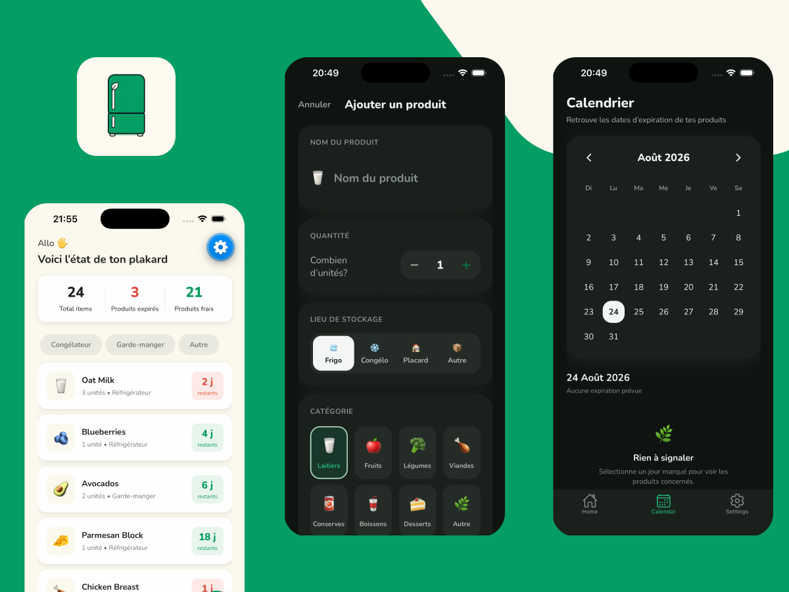

# Plakard

> A mobile app for tracking expiration dates, designed to make product management simple, visual, and local.



## About

Plakard helps track products stored in the fridge, freezer, pantry, or elsewhere. The app highlights upcoming expiration dates, schedules local reminders, and groups products in a calendar view.

This first version works entirely on the device: products are stored in SQLite and reminders are scheduled using the phone's notification system.

## Features

- add, view, edit, and delete a product;
- organize products by storage location and category;
- filter by location and urgency level;
- dynamic statistics about the state of the pantry;
- expiration date calendar;
- configurable local reminders;
- open a product page from a notification;
- light, dark, or system theme;
- dedicated states when no product matches the current view.

## Business logic

### Expiration status

A product's status is calculated from the number of days between today and its expiration date.

| Situation | Status | Display |
| --- | --- | --- |
| Past date | Expired | Red |
| 0 or 1 day remaining | Critical | Red |
| 2 to 4 days remaining | Watch | Yellow |
| 5 days or more | Fresh | Green |

For expiration dates far in the future, the interface displays an easy-to-read duration in months or years instead of a large number of days.

### Dates and alerts

- An expiration date must be in the future.
- Alert preferences that are not possible are automatically disabled.
- Reminders are scheduled at **9:00 AM**, based on the selected preference: the same day, 2 days before, 5 days before, or one week before.
- A reminder date that has already passed is never scheduled.

### Notification lifecycle

```text
Product added
  → saved in SQLite
  → reminder scheduled
  → notification_id saved

Edit
  → previous reminder canceled
  → SQLite updated
  → new reminder scheduled

Delete
  → reminder canceled
  → product deleted from SQLite
```

Permission is only requested from the onboarding or settings. If permission is granted later, Plakard tries to schedule missing reminders for existing products.

## Technical architecture

The project separates routes, visual components, global state, persistence, and business rules.

```text
src/
├── app/          Expo Router routes and navigation
├── screens/      Main screen composition
├── components/   Reusable cards and interface elements
├── context/      Products, notifications, and theme
├── data/         Models, options, and typed mappings
├── database/     SQLite migrations and repository
├── services/     Notification scheduling
├── theme/        Light and dark color palettes
└── utils/        Date calculations and formatting
```

### Main responsibilities

| Layer | Role |
| --- | --- |
| `ProductsContext` | Keeps React state, SQLite, and notifications in sync during CRUD operations. |
| `NotificationsContext` | Manages permission, onboarding, app resume, and navigation from a reminder. |
| `ThemeContext` | Resolves the active theme and stores the preference in SQLite key-value storage. |
| `product-repository` | Groups SQL queries related to products. |
| `migrations` | Versions the schema and protects existing data as it changes. |
| `product-options` | Centralizes categories, locations, alerts, labels, and UI ↔ persistence conversions. |

## Local persistence

The `products` table includes:

| Field | Purpose |
| --- | --- |
| `name` | Product name, limited to 80 characters |
| `quantity` | Quantity between 1 and 999 |
| `storage` | Normalized storage location |
| `category` | Typed persistent category |
| `expiration_date` | Local date in `YYYY-MM-DD` format |
| `alert_preference` | Selected reminder offset |
| `notification_id` | Identifier used to cancel or replace the reminder |
| `created_at` / `updated_at` | Technical creation and update dates |

SQLite runs in WAL mode. The schema applies constraints to important values, and an index makes sorting by expiration date faster.

## Reliability

- An Expo Router boundary displays a fallback screen if a critical startup error occurs.
- SQLite migrations normalize old data before applying recent constraints.
- Reminder scheduling errors do not prevent a product from being saved.
- Date and notification calculations are isolated in pure functions.
- Mappings between displayed and stored values come from a single typed source.

## Tests and quality

Unit tests currently cover:

- SQLite date parsing;
- leap years and daylight saving time changes;
- remaining day calculations;
- reminder dates and times;
- month changes;
- rejection of reminders scheduled in the past.

Commands used for checks during development:

```bash
npm test
npm run lint
npx tsc --noEmit
```

## Technologies

- Expo SDK 57 and React Native 0.86;
- Expo Router;
- strict TypeScript;
- Expo SQLite;
- Expo Notifications;
- Jest with `jest-expo`;
- Nunito and Expo Vector Icons.

## V1 scope

Plakard currently focuses on a local, fast, and privacy-friendly experience. Cloud synchronization, barcode scanning, photos, consumption history, and advanced statistics remain outside the scope of this first version.
